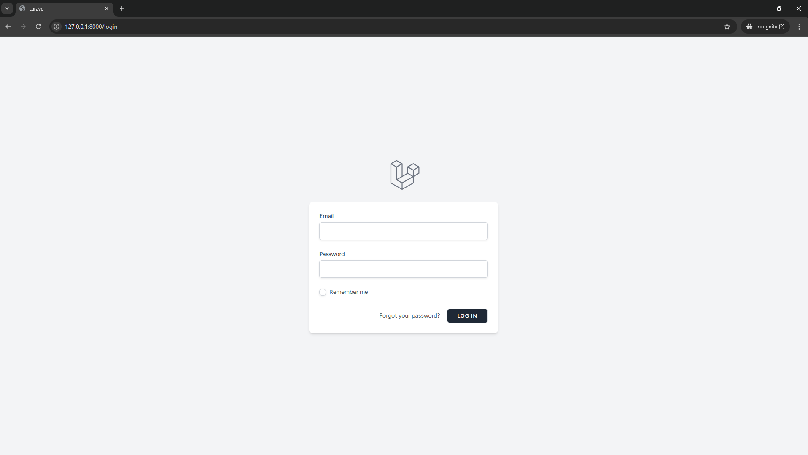
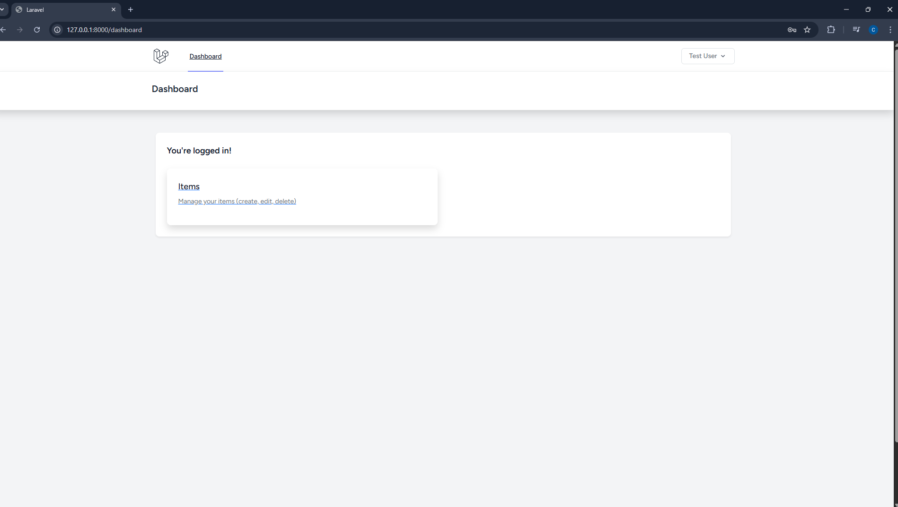
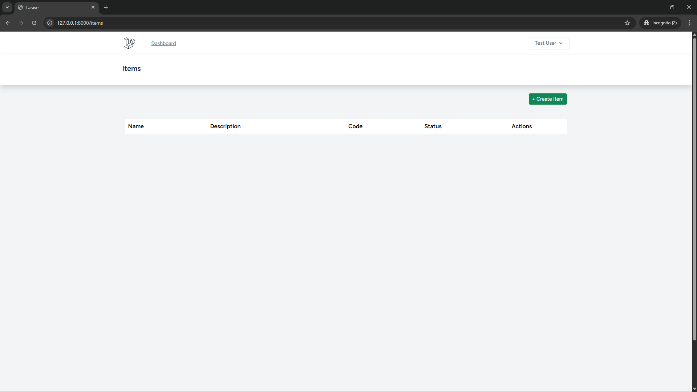
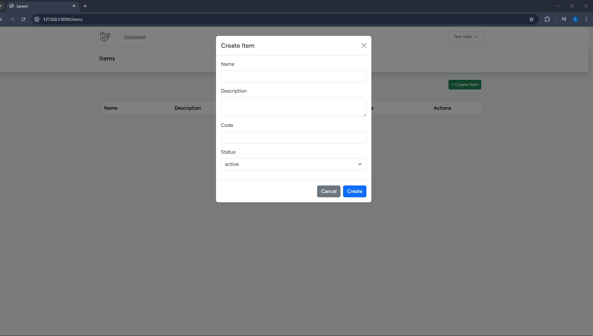
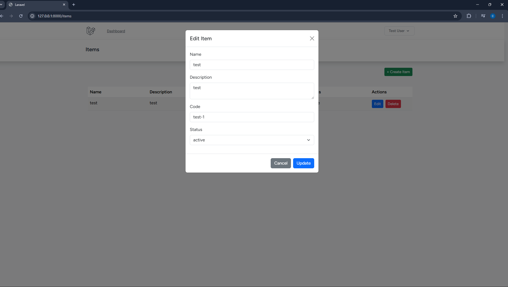
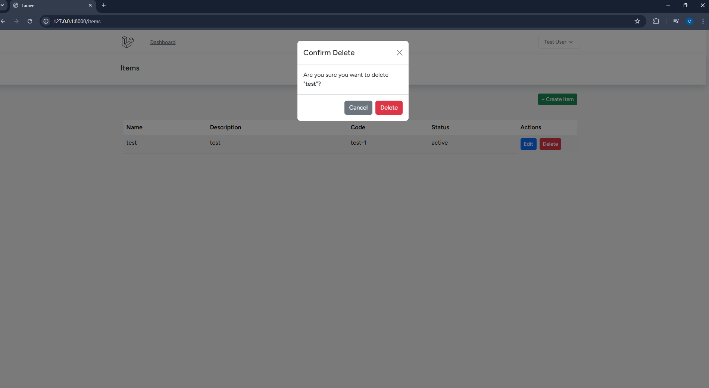

<p align="center"><a href="https://laravel.com" target="_blank"></a></p>

## CRUD API using Laravel for the backend and Blade, VueJS with Vue-Bootstrap and Axios for the frontend

## Requirements

To run the application the following needs to be installed

- PHP 8.1^
- Composer
- Node.js >= 20
- NPM
- PostgreSQL

## Installation & Setup

1. Clone the repository

```bash
git clone https://github.com/VladeCV/laravel-test.git
cd laravel-test
```

2. Install PHP dependencies:

```bash
composer install
```

3. Install JS dependencies

 ```bash
npm install
```

4. Create database

 ```bash
CREATE DATABASE "crud_test"
    WITH
    OWNER = postgres
    ENCODING = 'UTF8'
    LOCALE_PROVIDER = 'libc'
    CONNECTION LIMIT = -1
    IS_TEMPLATE = False;
```

5. Configure database

 ```bash
DB_CONNECTION=pgsql
DB_HOST=127.0.0.1
DB_PORT=5432
DB_DATABASE=crud_test
DB_USERNAME=postgres
DB_PASSWORD=your_password

```

5. Run migrations

```bash
php artisan migrate

```

6. Create a test user first with tinker

```bash
php artisan tinker

\App\Models\User::create([
    'name' => 'Test User',
    'email' => 'test@example.com',
    'password' => bcrypt('password'),
]);
```

7. Generate a password for the test user

```bash
$user = User::where('email', 'test@example.com')->first();
$user->password = Hash::make('password');
$user->save();
```

NOTE YOUR CREDENTIALS WILL BE email: test@example.com password: password

8. Start the application

```bash
php artisan serve
npm run dev
```

## Authentication

- Login is handled via Laravel Breeze
- API authentication uses Laravel Sanctum
- Axios is configured to send cookies automatically

## Available routes

```http
API Routes
```

| Method | URI                                    | Description    |
|:-------|:---------------------------------------|:---------------|
| GET    | `http://127.0.0.1:8000/api/items`      | List items     |
| GET    | `http://127.0.0.1:8000/api/items/{id}` | Get item by id |
| POST   | `http://127.0.0.1:8000/api/items/{id}` | Create item    |
| PUT    | `http://127.0.0.1:8000/api/items/{id}` | Update item    |
| DELETE | `http://127.0.0.1:8000/api/items/{id}` | Delete item    |

```
WEB Routes
```

| Parameter | Type                            | Description    |
|:----------|:--------------------------------|:---------------|
| GET       | http://127.0.0.1:8000/login     | Login page     |
| GET       | http://127.0.0.1:8000/items     | Item list page |
| GET       | http://127.0.0.1:8000/dashboard | Item list page |

## Screenshots

### Login page



### Dashboard page



### Items page



### Create item



### Edit item



### Delete item


